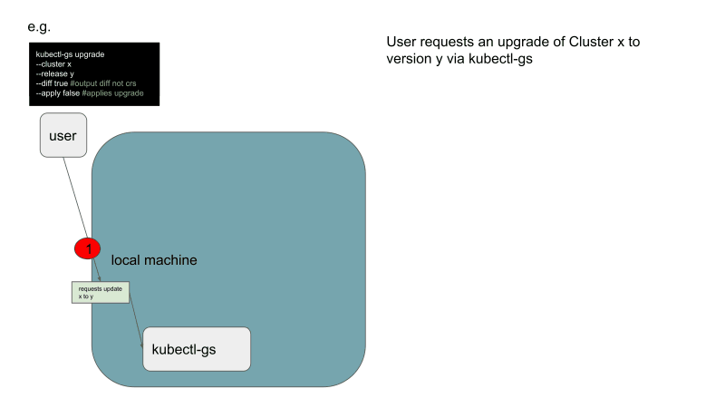

# Handling workload cluster upgrades

## Problem Statement

We want to ...
1. Make all changes transparent for the user before application
2. Continue supporting the upgrade of clusters by pressing a single button / writing a single command
3. Continue supporting a scheduled upgrade of a cluster
4. Integrate the process into the proposed gitops-management
5. Utilize the managed-configmap approach to ensure clusters adhere to the definition in their release at all times
6. Ensure that an upgrade to a cluster is decoupled from upgrades of other components
7. Allow easy integration into other pipelines and formats users might want to utilize for cluster management.

## Triggering an Upgrade

Our current method to trigger an upgrade is to change the release-version label on the `Cluster` resource. This can be done by GS staff, customers and automation through various interfaces.
This change will trigger the actual upgrade by letting a newer set of components manage the cluster.
However, when introducing the [new structure for releases](0_capi-releases), this process will be different. The release will no longer be tied to the components.
Instead, each release version will relate to a set of configmaps, defining the defaults and basic structure for the cluster resources.
So, triggering an upgrade in the future will mean to request the change of certain values within the CR itself. This is a breaking change since changing the release version label alone will no longer trigger an upgrade.
The reason for this is that we want to move towards a gitops-centered management of the cluster lifecycle.
Changes to the Cluster resources should ideally not be triggered inside kubernetes, but inside the source repository.

## Upgrade Mechanism

Once the upgrade of cluster `x` to version `y` has been requested, the cluster resources of `x` have to me mutated so that they adhere to the structure defined in the release `y` configmaps.
In order to make this possible, the mutating component needs to know the difference between cluster `x` and a cluster with the same configuration in version `y`.
One easy way to get this information is to make a `dry-run` request to the management API to create such a cluster.
The proposed changes can then be reviewed as a `diff` between the two clusters or just as the mutated cluster resources themselves.
This would also give us the chance to apply them not only directly via management-API but also by [creating a commit to a git repository](2_gitops-management).

## Mutable Fields

With the approach described above, we need to be aware of how specific fields should be treated during an upgrade.
If an empty field has a default value in the new version, it should be defaulted to this value.
If a populated field has a default value in the new version, we can either overwrite it or leave it unchanged.
In order to determine which fields are mutable and should be overwritten during an upgrade, the definition of mutable fields has to be part of the release definition itself or a separate upgrade definition.
When caluclating the `diff`, this definition has to be taken into account.

## Client

We use `kubectl-gs template` to create templates for cluster creation. It seems straight-forward to add functionality to handle upgrades as well.
This should include the ability to review changes, apply the upgrade directly and creating commits to git repositories used for cluster management.

## Example workflow

See slides [here](https://docs.google.com/presentation/d/1_ImURpdO3T8HxyBNraTsoAiPJy6ZEidgEE7s_8i86K0/edit?usp=sharing).

## Open Questions

- How can we simplify this procedure?
- How does this integrate with `happa`?
- ?