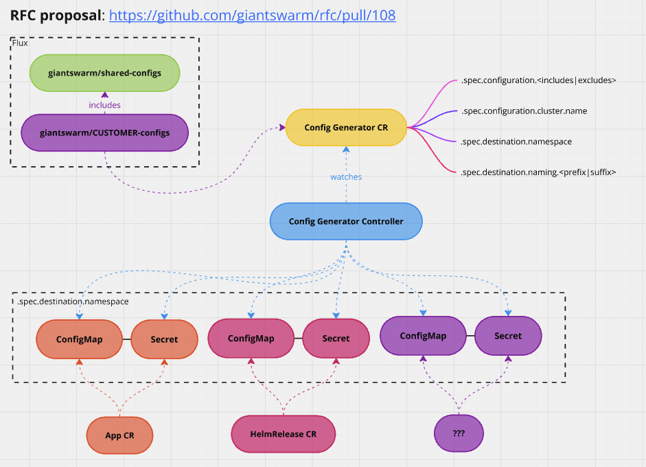

# Configuration rendering controller

Contents:

1. Introduction
2. Current practice
3. Proposed solution
4. Implementation approaches

## Introduction

We have a way to configure our applications by means of [shared-configs](https://github.com/giantswarm/shared-configs) and customer specific config repos (CCRs). Still, this applies only to Apps that are deployed as a part
of collections (like [aws-app-collection](https://github.com/giantswarm/aws-app-collection)). The idea discussed in this RFC is to decouple the configuration system from App Platform and make it possible to use with any App (both in and out of collections).

## Current practice

The current configuration system is built on the [shared-configs](https://github.com/giantswarm/shared-configs) and
customer specific config repositories (CCRs). It is only taken into account tho, if Apps are deployed in a specific way:

- it must be deployed via our custom Flux under `flux-giantswarm`
- and it must be defined as a `konfigure` resource of `generators.giantswarm.io/v1` that is an input for `kustomize`
  KRM function defined in [konfigure](https://github.com/giantswarm/konfigure/)
  - `konfigure` can also be used locally to generate the configuration and the App CR as well without the generator

Although, it would be possible to deploy such generator resources anywhere in our GitOps structure to take advantage
of the configuration system, we only use that in `collections`, the provider specific ones and
[rest-api-collection](https://github.com/giantswarm/rest-api-app-collection).

The current configuration structure is documented in details [here](https://intranet.giantswarm.io/docs/dev-and-releng/configuration-management/).

Especially check out:

- structure: <https://github.com/giantswarm/giantswarm/blob/2d47774e81ef14b060a8c2e10b07fa365fab4320/content/docs/dev-and-releng/configuration-management/app-platform-configuration-management.jpg>
- flow: <https://github.com/giantswarm/giantswarm/blob/2d47774e81ef14b060a8c2e10b07fa365fab4320/content/docs/dev-and-releng/configuration-management/app-platform-flux-konfigure.jpg>

In this proposal we are not going to change that structure, just the flow, so that we make it more widely accessible,
flexible, easier to extend while also making other parts of our platform more simple.

### Problems with the current practice

- deployment must be done in a specific way via the Giant Swarm Flux installation and in a custom format (in practice: collections)
- the generated resource is always an App CR and no other formats are supported
- to make it work, the Giant Swarm Flux installation on the MCs use a forked version the
  [kustomize-controller](https://github.com/giantswarm/kustomize-controller) and the
  [fluxcd/pkg](https://github.com/giantswarm/fluxcd-pkg) package that enables KRM function support in the
  underlying `kustomize` library, that is actually still alpha features. It was proposed to make it an option
  to enable plugins, but was rejected upstream.

There are some other problems with the capabilities of the configuration system as well:

- we are currently storing configuration in Giant Swarm Catalog bound Config Maps as well. These will be only
  resolved by `app-operator` as they are implicitly taken as the base layer that upon all other configuration
  layers are merged
- there is no support for providing different configurations for multiple instances of a given app
  - there is no support for providing configuration for workload cluster apps

## Proposed solution

The proposal is to decouple the configuration system from App Platform. We want to implement a controller that
renders all the configs present in the `shared-configs` and CCR repositories to a given namespace, without any
dependency on how this configuration is used. Once the configuration is rendered, it is up to the user to use it
wherever they want (i.e. reference it in an App CR, but potentially also elsewhere, like in a HelmRelease).



Source: <https://miro.com/app/board/uXjVKUVwcLg=/>

In this proposal we will show how we can solve some of our immediate problems listed above, simplify our setup
and maintenance costs and open up the system for extension to solve our other problems.

### The configuration rendering operator

We can reuse `konfigure` as a library in a Kubernetes operator that reconciles a custom CR to pre-render all or a
given subset of configuration to a destination namespace.

This way, anything is open to mount the configuration config maps and secrets whether they are Giant Swarm App CRs,
Flux HelmReleases or whatever comes next.

App Platform supports cross namespace references to some extent. It is simply RBAC restricted for workload cluster
operators. The unique `app-operator` can read CM and Secrets from all namespaces. We can implicitly deploy one instance
of the new CRD with a scope covering all configured apps to a Giant Swarm restricted namespace, be it `giantswarm` or a new `giantswarm-configs`
namespace.

We know a complete list of possible Apps that can be configured, because the current system requires that for all
possible deployed App there are default in the `shared-configs` repository. We would generate the CM and the Secret
for each possible App for the given MC and the given `shared-configs` + CCR repo reference in the destination namespace.

The name of the CMs and Secrets should be generated in a deterministic way. We already sort of do that. For example
for the App `kyverno` the `kyverno-konfigure` CM and Secret is getting rendered by `konfigure`.

The CRD should be open to filter the Apps to generate the configuration for. This makes it possible to render subsets
of the whole configuration to different namespaces. This is especially useful for Flux HelmReleases that do not
support cross namespace references for values from CMs and Secrets.

It is worth noting here, that the decoupling also comes with a generic problem in Kubernetes where there are dependencies
between resources. Since in this new system, we can expect that configs are pre-rendered, the workloads can freely
mount them. However, especially if the 2 CRs are deployed together, it takes time for the CM and Secret to get
deployed. For Flux HelmReleases it will simply initially result in a failure as the mounted CM and / or Secret does
not exist yet - unless marked as optional -, and simply a following reconciliation will eventually deploy the release.

For App CRs however, we do have a rule in `app-admission-controller` that rejects an App CR if it references a CM or
Secret under `.spec.config` or `.spec.userConfig` that does not exist. This should be relaxed, made optional or even
better removed all together. We could also turn it into a warning - supported by admission controllers in kubernetes,
see [here](https://kubernetes.io/docs/reference/access-authn-authz/extensible-admission-controllers/#response).
In an ever-changing Kubernetes environment, it is fair to expect the system to become eventually consistent
and self-healing. This is the practice in other operators as well. The problem should be raised when the App CR
does not get eventually healthy, for which we already have alerts in place. Also, this does not raise a new problem
but one we already have and is native to the ecosystem we are working on, just think of Flux and
its CRDs with which it operates but also eventually manages itself with.

Additionally, with the configuration system decoupled, App Platform could also be open for extension of being able to
detect expected configurations or to react when they change. For example by supporting emitting Kubernetes event
that App Platform or any component could watch and reconcile the resource earlier.

In my opinion, it is strongly discouraged to automagically mount generated configuration for multiple reasons:

- one of our major concerns with the current system is the magic implicit way of Catalog configs.
  I believe explicit is better than implicit.
- we simply cannot mount it to all App CRs let say, because they do not have them now. Changing their configuration
  is already a good reason, but also we could also randomly roll apps as well
- `app-admission-controller` is already burdened with auto mounting logic. That one, as an admission controller
  however would only react when and App CR gets created or updated. Watching all CMs and Secrets could be proven
  too much and making changes to App CRs in reaction to that seems like a bad idea from a webhook with time
  restrictions on them imposed by Kubernetes.
- `app-operator` also has some auto mounting logic for user values and secrets. If anywhere, maybe in this operator
  some clever logic could be implemented but that is separate from the scope of the current subject of this RFC

It is important, that new controller for configuration management has absolutely zero knowledge of App Platform or
potentially also Flux. Tho there is an opportunity here also to couple the new controller with Flux, more on that
later at implementation details.

### Problems solved with the decoupling

- any form of resource, be it App CRs, Flux HelmReleases or anything that comes in the future can use the generated
  configurations
- it is no longer required to deploy workloads in a specific way to take advantage of the configuration system if needed
- we can get rid of our custom fork of `kustomize-controller` and `fluxcd/pkg` which makes upgrades and maintenance
  much easier and open us up to use the recently announced
  [flux-operator](https://medium.com/@stefanprodan/introducing-the-flux-operator-gitops-on-autopilot-mode-b8f7b7f149fb)
  in the future

Additionally, since on CAPx especially, only `collections` and `rest-api-collections` use the configuration
management, it would be easy to migrate them to raw App CRs with the expected CMs and Secrets already declared on them.
We could even prepare it with a script to turn the `konfigure` generators into raw App CRs. We could keep the same
deployment method. Once the CMs and Secrets are pre-rendered, we can merge the change and let Flux simply reconcile.
This also opens up more fine-grained access on these app CRs like labels, annotations, extra configs, timeout
configuration and so on that is currently not possible with `konfigure` generators.

Also, if we apply patches to the generated App CRs in gitops, they would still apply, cos we still have the same
App CR, just in raw form now, instead of the generated one.

With all generators gone, we could get rid of the KRM function implementation in `konfigure`. For one, this is still
an alpha feature. It's hard to develop and debug as the `konfigure` binary is invoked by `kustomize`. It is also
the reason for the infamous error on our `collection` Flux kustomization:

```text
kustomize build failed: couldn't execute function: MalformedYAMLError: yaml: line 19
```

We cannot improve on this error message because how `kustomize` internally handles the output from the called binary.

With the generators gone, we could get rid of this all-together.

### Security concerns

Like mentioned above, on CAPx, the configuration management is only used by `collection` deployed workloads. These
are all for the MC and they are all reconciled by the unique `app-operator`, which has RBAC rights to access the
generated CMs and Secrets in any namespace.

For workload cluster `app-operators` that might need access to configurations in the future, we could either give
access to the namespace for CMs and Secrets that contains all rendered configs - if they would use the same -
or render the workload cluster specific level to the given namespace. For one, the CR should be able to support that
scope change. For another we do not have that implemented in the current system. The main issue here however is not
a problem with this system, but with what we can share freely with customer workloads. For example, `shared-configs`
is still kept private, because it contains - even if each encrypted with MC unique keys - minor Giant Swarm sensitive
information. They are required by vintage to my knowledge, but they are there nevertheless and a security audit
should be carried before we make that repository public.

### Extending configuration management in the future

Currently, we mostly utilise Catalog configuration for cluster apps. I think the reason for it is that it is not
possible at the moment to utilise the configuration system when we deploy such workloads, so the configuration
drifted into the catalogs, as the `cluster` catalog has well-defined scope for such apps.

With easy access to configuration management, these catalog configs could simply drift into the config structure
for the apps that need them on the MC specific level, and we could then simply get rid of them.

## Implementation approaches

### Framework

The new controller should be written using [kubebuilder](https://book.kubebuilder.io/). It is on our roadmap to
[Remove `operatorkit` as a dependency](https://github.com/giantswarm/roadmap/issues/3722) and this would be a great
opportunity to get some hands-on experience with `kubebuilder`, as most of those operators that need and upgrade
is owned by Team HoneyBadger.

### Possibility to utilize Flux source-controller

It is already implemented in `konfigure` to fetch the sources from Flux `source-controller` with `include`
feature support [here](https://github.com/giantswarm/konfigure/pull/278).

It would potentially be best to not depend on Flux either, but since we already have it implemented, and we would
need to do something very similar to fetch and assemble the sources, we could cut this corner now and keep
using Flux.

ℹ️ DECISION: We decided to use Flux for now as it is already implemented and a convenient way to pull the assembled CCR repo.

There is potential to later implement custom DSL to describe how to merge configurations, which could make sense
if we want to introduce many different layers in the future (catalogs, workload-cluster, app instance, etc. specific
configs). For now, it makes sense to keep our current logic as is to reduce time to implement and friction.

### Defining scope of configs to render

```yaml
apiVersion: configuration.giantswarm.io/v1alpha1
kind: ManagementClusterConfiguration
metadata:
  name: gauss-configuration
  namespace: giantswarm
spec:
  sources:
    flux:
      service:
        url: source-controller.flux-giantswarm.svc
      gitRepository:
        name: giantswarm-config
        namespace: flux-giantswarm
  destination:
    namespace: giantswarm-configuration
    naming:
      suffix: ex1
      prefix: test
      useSeparator: true
  configuration:
    cluster:
      name: gauss
    applications:
      includes:
        exactMatchers:
          - app-operator
          - chart-operator
          - no-such-operator
        regexMatchers:
          - ".+"
      excludes:
        exactMatchers:
          - kvm-operator
        regexMatchers:
          - trivy.*
  reconciliation:
    interval: 5m
    retryInterval: 1m
status:
  conditions:
    - lastTransitionTime: "2024-12-18T12:20:12Z"
      message: 'Attempted revision: 1fb7f4a0df83361cd85e7d5b21b7a02f0a825167'
      observedGeneration: 42
      reason: ReconciliationFailed
      status: "False"
      type: Ready
  failures:
    - appName: app-operator
      message: "secrets "test-app-operator-ex1" already exists"
    - appName: chart-operator
      message: "Invalid Yaml at installations/gauss/apps/chart-operator/configmap.tmpl:42"
  misses:
    - no-such-operator
  lastAppliedRevision: 38be874bfa3d627bf70366bd3ae43ff9dcfb4fcf
  lastAttemptedRevision: 1fb7f4a0df83361cd85e7d5b21b7a02f0a825167
  lastReconciledAt: "2024-12-18T12:20:12.358526+01:00"
  observedGeneration: 42
```

#### About .spec.sources

Like mentioned above, the sources could be potentially pulled in many different ways.

We are currently utilizing Flux and its `include` feature to merge `shared-configs` and the CMC repository
configuration. This technically has historic reasons dating back to `config-controller` on Vintage, therefore
I would leave it open as an object to configure sources. Also keeping Flux for now could simplify implementation
as we already have it done. We will go with that and utilize Flux.

Later we could simply add other ways to support fetching sources.

#### On encryption and SOPS keys

In `konfigure` there is logic to fetch keys from a local directory of from Kubernetes from secrets with the label
`konfigure.giantswarm.io/data: sops-keys`. As a start we will go with the auto fetching from Kubernetes logic as
we already have the keys deployed with this label to also be used by Flux `kustomize-controller`.

If need be, we can support mounting the secrets manually and pointing the operator to the folder.

Thus, since we start with a default logic, we do not have a `.spec.encryption` object in the CR for now. 

#### About .spec.destination

It is intentionally singular. I would recommend allowing only a single destination per resource.

The simplest destination now is `namespace` within the same cluster. We could potentially allow workload clusters
here as well so `kubeconfig` secret references, for example:

```yaml
spec:
  destination:
    namespace: default
    kubeConfig:
      context:
        name: staging-admin@staging
      inCluster: false
      secret:
        name: staging-kubeconfig
        namespace: staging
```

The `.spec.destination.naming` object contains information on the `.metadata.name` of the generated resources. We
should impose limitation on the length of the prefix and the suffix, cos the generated name should look like this
in the end: `<PREFIX>-<APP_NAME>-<SUFFIX>`. Both config maps and secrets must follow the DNS subdomain name restriction:
https://kubernetes.io/docs/concepts/overview/working-with-objects/names/#dns-subdomain-names

See:
- https://kubernetes.io/docs/concepts/configuration/configmap/#configmap-object
- https://kubernetes.io/docs/concepts/configuration/secret/#restriction-names-data

The `.spec.destination.naming.useSeparator` is turned on by default and means adding the `-` character between the parts.
It cannot be controller separately for prefix and suffix. You could still disable it and add the `-` to only one of them
if really need be.

#### About .spec.configuration

This is the section that defines scope. By default, I would recommend that the scope is empty. All configuration
here means adding something to the scope. For simplicity, I would recommend only allowing additions to the scope.

The `.cluster` object would point to the Cluster configs to render under `.name`. This technically points to
CMC repo's `installations/{NAME}` folder.

The `.spec.configuration.cluster.name` is intentionally part of the CRD configuration. It is more practical to have
it here then let's say as an operator configuration. If a user can present the SOPS keys for a given cluster, why not
allow rendering configs for another cluster as well. This could be very practical for testing and debugging purposes
as well. And since we already did the config split migration, a given CCR repository only contains customer configs.

The `.applications` node adds items to the scope from `installations/{NAME}/apps` folders if the CMC repos.

We should support both `includes` and `excludes`.

For both objects, I would recommend supporting multiple different kind of "matchers" for flexibility:

- `regexMatchers`
  - It is a list of regular expressions, potentially conforming: <https://github.com/google/re2/wiki/Syntax>.
    This could be used with simply `.+` to match all applications.
  - Alternatively, this could be used to match a family of apps, for example: `trivy.*`
- `exactMatches`
  - This could be a list of string for the folders to include. Could be for a concrete list of apps or potentially
    just a single app if needed. For example: `["prometheus", "loki", "grafana"]`

The logic would be:

- list all possible apps in the fetched source
- add all apps from the full set that matches any `.spec.configuration.applications.includes.exactMatchers` to the result set
- add all apps from the full set that matches any of the `.spec.configuration.applications.includes.regexMatchers`
- remove all apps from the result set that matches any `.spec.configuration.applications.exlcudes.exactMatchers`
- remove all apps from the result set that matches any `.spec.configuration.applications.exlcudes.regexMatchers`
- the result set is finished
- also return a list of misses later recoded in `.status.misses`, that is a list of `.spec.configuration.applications.includes.exactMatchers`,
  that did not result in a hit on the list of all possible apps

##### Labelling the generated resources

We should add the following labels to all generated resources to identify their owner (owner reference are bound to the
same namespace for owner and owned resource). These can also be used within the controller for conflict detection, when
for example multiple config resources would try to manage the same generated resource.

```yaml
labels:
  configuration.giantswarm.io/generated-by: konfigure-operator
  configuration.giantswarm.io/ownerApiGroup: konfigure.giantswarm.io
  configuration.giantswarm.io/ownerApiVersion: v1alpha1
  configuration.giantswarm.io/ownerKind: ManagementClusterConfiguration
  configuration.giantswarm.io/ownerName: gauss-configuration
  configuration.giantswarm.io/ownerNamespace: giantswarm
  configuration.giantswarm.io/revision: 38be874bfa3d627bf70366bd3ae43ff9dcfb4fcf
```

Note that `configuration.giantswarm.io/ownerApiVersion` should not be part of the collision detection to allow
upgrades on the CRD.

### About .status

I would recommend getting quite verbose here in order to make it easier to see the status, debug and alert on failures.

The `.inventory` field should contain the list of object references that are managed by the given scope. This could
also be used for clean up. For example what to do when the scope changes and something get removed from it. Should
we delete the referenced resource or orphan it? Do we need the strategy to be configurable? We do not necessarily
need to decide now, but the inventory makes it possible in the future and is useful anyway.

This field is very similar to the Flux Kustomization inventory:

```yaml
status:
  inventory:
    entries:
      - id: giantswarm-configuration_app-operator-konfigure__ConfigMap
        v: v1
      - id: giantswarm-configuration_app-operator-konfigure__Secret
        v: v1
      # ...
```

ℹ️ DECISION: We decided to discard the inventory and only record `failures` and `misses`. We should be able to easily
query the generated resources via the added labels.

For an overview of when and what version was last reconciled we have:

```yaml
status:
  lastAppliedRevision: 38be874bfa3d627bf70366bd3ae43ff9dcfb4fcf
  lastAttemptedRevision: 1fb7f4a0df83361cd85e7d5b21b7a02f0a825167
  lastHandledReconcileAt: "2024-12-18T12:20:12.358526+01:00"
```

where:

- `lastAppliedRevision` is the last revision where the all resources where successfully generated.
- `lastAttemptedRevision` is the last attempted revision. In case of success, this matches `lastAppliedRevision`.
- `lastHandledReconcileAt` is the last time a `lastAttemptedRevision` was attempted to reconcile.

Based on the above if nothing else is present, we can assume that everything is reconciled fine at `lastAppliedRevision`.
In case of failures, when `lastAttemptedRevision` does not match `lastAppliedRevision` we have a convenient field to
list each individual failures and the reason for the failure: `.status.failures`. It is a list of objects
with the following fields:

- `name`: Name of the app.
- `message`: Detailed error message about the failure.

We should be able to assume the failure took place at `.status.lastHandledReconcileAt` and at revision `.status.lastAttemptedRevision`.

We should have `conditions` as the generic kubernetes object status list, for example:

```yaml
status:
  conditions:
    - lastTransitionTime: "2024-12-18T12:16:42.358526+01:00"
      message: "Applied revision: 38be874bfa3d627bf70366bd3ae43ff9dcfb4fcf"
      observedGeneration: 442
      reason: ReconciliationSucceeded
      status: "True"
      type: Ready
```

or in case of failure:

```yaml
status:
  conditions:
    - lastTransitionTime: "2024-12-18T12:20:12.358526+01:00"
      message: "Attempted revision: 1fb7f4a0df83361cd85e7d5b21b7a02f0a825167"
      observedGeneration: 443
      reason: ReconciliationFailed
      status: "False"
      type: Ready
```

In case not the generation failed but setting up `konfigure` for generation, e.g. the referenced `source-controller`,
or the source not found, or the SOPS environment failed to set up, we should have another `reason` here, for example
called `SetupFailed` and then `message` contains information on how did it fail.

This could be a simple and convenient place to check and setup alerts based on when the overall status is
not healthy for the CR, e.g. not all items for successfully generated. Tho checking for failures list might
work as well, tho that is rather for details for easier debugging within the cluster.

#### About .reconciliation

This section should contain information on how to reconcile the CR and the generated resources potentially.

For a start we can have `.inteval` here in Go duration format.

For retry on failure, we support `.retryInterval`, also in Go duration format.

We could support deletion policies like delete / orphan here later.

### Reconciliation loop concerns

TBD:

- multiple resource are potentially matched within a single CR's scope. Should / can we make it parallel to reconcile
  these or should we go with go routine and merge the results back?
- logic for deleting / orphaning resources in the inventory?
- Kubernetes is not designed for "transactions", e.g. what if the generation is ok, the config map applies, but the
  secret apply times out? Is it okay to live wit this slim chance and on the next reconciliation the secret will apply
  as well if it was an intermittent issue? Should we support complex roll back logic? What if the rollback times out
  and so on?

### Migrating `collection` repositories

The `collection` repositories can be easily turned into raw App CRs with a script.

The new controller would potentially be easy to roll out as it is generating new resources to given location.

The `rbac-operator` will potentially need a change to support access to the CMs and Secrets.

Once we have that done, we simply merge change to `collection` repositories. Because we have `prune` disabled,
we will need to clean the old CMs and Secrets manually, unless we turn it back on.
