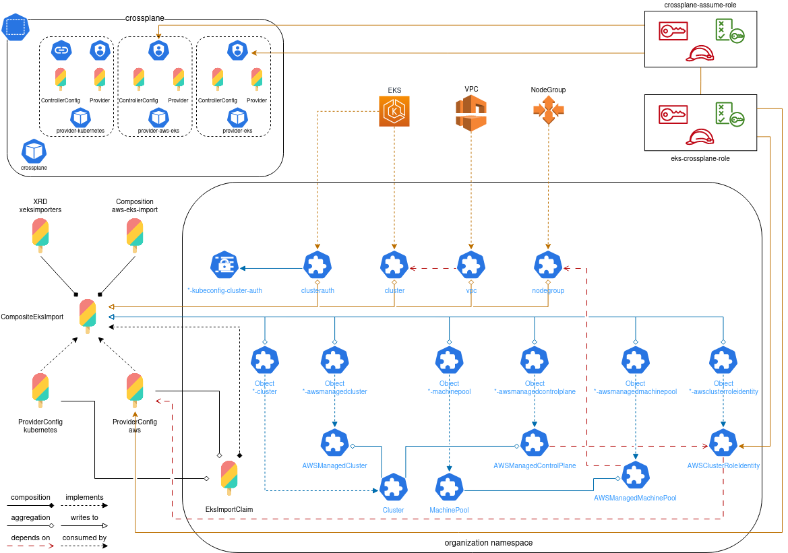

# Importing EKS/AKS/GKE clusters to CAPI using crossplane

## Introduction

Team Honeybadger has proposed a solution to importing existing clusters to CAPI
via the use of crossplane in place of writing our own custom importer.

The purpose of this is to provide a mechanism whereby customers may come to
Giant Swarm on a Bring Your Own Cluster (BYOC) basis such that we can support
and manage apps on the customers cluster without compromising the integrity of
their existing infrastructure deployment mechanisms. That is to say, customers
operate and manage their own infrastructure, whilst we provide support and
deployment strategies for our own applications to run inside the customers
cluster.

Throughout this RFC, where the words __import__ and/or __adopt__ are used, they
are to be read as "unmanaged".

## Problem Statement

In order to onboard a customers cluster to a Giant Swarm management cluster, we
require visibility to the customers cloud account from which we can execute a
discovery of the cluster resources and reflect these back as CAPI resources
inside the cluster.

For this to be effective, there are then three primary components to the import
process.

1. Security of the cloud account.

   We work on the basis that we only have read only access to see only components
   necessary for the import of the cluster.

2. The capability of reading existing customer resources

3. Reflection of customer resources in CAPI

For the purposes of this RFC, point 1, Security of the cloud account is
considered out of scope and will be managed on a cloud by customer basis as part
of the implementation.

The caveat to this is that we are under the assumption that only read access
will be granted and that the customer may place strict limitations on our
visibility of components inside their accounts.

Whilst there is some functionality to read resources directly from CAPI, it
would require additional development effort to realise in order to generate
both the `kubeconfig`, and any resources required for the delivery of apps and
app-bundles to the cluster.

This in itself places risk of accidental adoption of the cluster by CAPI in such
a manner that the cluster would be brought fully under the control of CAPI
operators in such a manner that violates the contract of adoption.

### Options

1. We create our own custom importer based on CAPI that can create the
   `kubeconfig` and any CRs that may be required to deliver functionality for
   import to be successful

2. We leverage an existing technology outside of CAPI to create the resources
   required.

### Solution

In order to facilitate ease of operation, reduce overhead on teams and increase
the probability of time to market, Honeybadger proposed facilitating the creation
of resources using crossplane as an intermediate technology.

This was made possible by crossplane implementing the capability of `ObserveOnly`
resources that allow for the discovery of infrastructure inside cloud accounts
without requiring full ownership.

It is recognised from the team that `ObserveOnly` resource functionality is still
considered alpha functionality on a per provider basis but testing has shown this
to be stable enough for adoption and use given our current requirements for the
product.

## Architecture

In order to maintain consistency between providers, we propose the creation of
Crossplane Composite Resource Compositions that read information from the cloud
account and place it into custom resources generated by crossplane.

Each cloud provider will work in similar ways and in order to achieve this,
we require additional components to be installed into the management cluster.

- crossplane core
- crossplane-contrib/provider-kubernetes  for the creation of resources inside
  the cluster

To enable management of resources inside each cloud, the importer will require
the following additional providers depending on the cloud being managed through
that management cluster.

| AWS              | Azure                           | GCP                      |
|------------------|---------------------------------|--------------------------|
| provider-aws-ec2 | provider-azure-azure            | provider-gcp-compute     |
| provider-aws-eks | provider-azure-containerservice | provider-gcp-container   |

The full PoC of how this may work for EKS clusters can be found in the
repository [crossplane-eks-capi-import](https://github.com/giantswarm/crossplane-eks-capi-import/)

Overall the architecture between providers is expected to be similar across
cloud providers but for the remainder of this RFC, the EKS architecture will be
used.



### Composition and Definition

The crossplane composition for this importer follows the definition which allows
for a minimum of the following to be defined

- The region the cluster is built in
- The cluster name
- The nodegroup name

This information is then used to look up the cluster details inside the cloud
provider to be fed to the CAPI resources being generated.

To achieve this lookup, we use crossplane resources for the cloud being searched

| provider-aws-eks                 | provider-azure-containerservice                               | provider-gcp-[container,compute]   |
|----------------------------------|---------------------------------------------------------------|------------------------------------|
| Cluster (eks.aws.upbound.io)     | KubernetesCluster (containerservice.azure.upbound.io)         | Cluster (container.gcp.upbound.io) |
| NodeGroup (eks.aws.upbound.io)   | KubernetesClusterNodePool (containerservice.azure.upbound.io) | NodeGroup (compute.gcp.upbound.io) |
| ClusterAuth (eks.aws.upbound.io) |                                                               |                                    |

During the generation process, there are certain details that may (excluding the
use of composition functions) require the editing of specific blocks of the
composition.

The reason for this is that there is no looping inside the composition and
details returned from the cloud do not directly correlate to information required
by CAPI.

The example of this inside EKS is the subnet groups required by the
`AWSManagedControlPlane` resource which then require hard coded specification
via patching.

```yaml
- fromFieldPath: status.subnetIds[0]
  toFieldPath: spec.forProvider.manifest.spec.network.subnets[0].id
- fromFieldPath: status.subnetIds[1]
  toFieldPath: spec.forProvider.manifest.spec.network.subnets[1].id
- fromFieldPath: status.subnetIds[2]
  toFieldPath: spec.forProvider.manifest.spec.network.subnets[2].id
- fromFieldPath: status.subnetIds[3]
  toFieldPath: spec.forProvider.manifest.spec.network.subnets[3].id
- fromFieldPath: status.subnetIds[4]
  toFieldPath: spec.forProvider.manifest.spec.network.subnets[4].id
- fromFieldPath: status.subnetIds[5]
  toFieldPath: spec.forProvider.manifest.spec.network.subnets[5].id
```

It may be feasible to correct this through the use of composition functions but
this has not yet been explored as an option.

### CAPI resources

Compositions implementing this RFC will create the following CAPI resources:

- Cluster
- MachinePool

Additionally cloud specific providers should be created

| AWS                    | Azure                    | GCP                    |
|------------------------|--------------------------|------------------------|
| AWSManagedCluster      | AzureManagedCluster      | GCPManagedCluster      |
| AWSManagedControlPlane | AzureManagedControlPlane | GCPManagedControlPlane |
| AWSManagedMachinePool  | AzureManagedMachinePool  | GCPManagedMachinePool  |

### `kubeconfig`

The `kubeconfig` secret is normally generated by CAPI controllers and stored
in the cluster namespace as `<cluster_name>-kubeconfig`

As CAPI should be running in a non-reconcilling mode for imported clusters,
it is not known if this kubeconfig will be generated automatically by CAPI or
whether it needs to be imported separately.

To work around potential limitations here, crossplane leverages the
`cluster-auth` capabilities and stores this secret as `<cluster_name>-kubeconfig-cluster-auth`

This secret contains a slightly different structure from CAPI and places the
kubeconfig at the secret data key `data.kubeconfig`.

This cannot be controlled via crossplane and in order to make this secret
compatible with our own deployments via `App-Platform` we may need to enhance
our `App` CR to accept a secret data key, or include this location in the list
of key locations checked for a `kubeconfig` value.

### Discovery

With the introduction of EKS/AKS/GKE clusters to CAPI management clusters, we
need to be able to differentiate between the different types and usage.

This can be achieved through the use of the type of cluster defined as
`infrastructureRef` and the presence or absense of the `clusters.x-k8s.io/managed-by`
annotation:

|                   | Normal CAPI                          | CAPI Managed                                              | CAPI Adopted                                              |
|-------------------|--------------------------------------|-----------------------------------------------------------|-----------------------------------------------------------|
| infrastructureRef | AWSCluster, AzureCluster, GCPCluster | AWSManagedCluster, AzureManagedCluster, GCPManagedCluster | AWSManagedCluster, AzureManagedCluster, GCPManagedCluster |
| annotation        | -                                    | -                                                         | clusters.x-k8s.io/managed-by: crossplane                  |

### Preventing CAPI takeover

To prevent CAPI from importing and controlling the resources, each resource
should be annotated with `clusters.x-k8s.io/managed-by: crossplane`.

This annotation is defined in the proposal on [Externally Managed cluster
infrastructure](https://github.com/kubernetes-sigs/cluster-api/blob/main/docs/proposals/20210203-externally-managed-cluster-infrastructure.md)
which defines:

> An InfraCluster CR with the `cluster.x-k8s.io/managed-by: "<name-of-system>"` annotation.
>
> The provider InfraCluster controller must:
>
> - Skip any reconciliation of the resource.
> - Not update the resource or its status in any way
>
> The external management system must:
>
> - Populate all required fields within the InfraCluster spec to allow other CAPI
>   components to continue as normal.
> - Adhere to all Cluster API contracts for infrastructure providers.
> - When the infrastructure is ready, set the appropriate status as is done by
>   the provider controller today.

It is known that this annotation is not fully implemented for EKS clusters and
this presents an immediate problem towards its use as the CAPA controller
attempts to import the cluster, managing status' and attempting to reconcile
the cluster.

For the existing PoC, this is blocked via cloud IAM and can be additionally
mitigated using `spec.paused: true` but not without certain risk and the
preference would be for this to be implemented upstream.

### Why not just use `spec.paused` or annotation `cluster.x-k8s.io/paused`

Whilst it is valid to include either of these on the resources, and they have
the effect of ensuring CAPI does not reconcile the resource, there is a trade-
off with the level of volatility brought to the platform as a result.

It is perfectly valid to pause a number of resources for any reason for an
arbitrary amount of time and the property or annotation may be removed
accidentally allowing the resources to immediately fall under CAPI control.

Once under control of CAPI, they cannot be removed from its control without
considerable additional effort. (see [What happens when a user converts an
externally managed InfraCluster to a managed InfraCluster?](https://github.com/kubernetes-sigs/cluster-api/blob/main/docs/proposals/20210203-externally-managed-cluster-infrastructure.md#what-happens-when-a-user-converts-an-externally-managed-infracluster-to-a-managed-infracluster))

It is better to be explicit via the use of the `cluster.x-k8s.io/managed-by`
annotation which at least offers baked in clarity of its existence.
