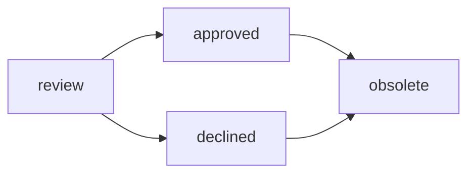

# RFC and decision making process

This RFC-of-RFCs aims to expand on the current RFC process by introducing an explicit, lightweight decision making process.

We use the terms "RFC" and "decision" quite interchangeably. Think of a _decision_ as precisely what the word means, and an _RFC_ as its written-down version as Markdown file.

At the moment, the concept of [ADRs](https://intranet.giantswarm.io/docs/product/architecture-specs-adrs/adr/) and [PDRs](https://intranet.giantswarm.io/docs/product/pdr/) are not covered here and their processes do not change yet. We may want to amend this later.

Goals of the process:

- Quick progress on RFCs and decision making
- Relevant groups have seen and approved the decision
- More structured RFC format to add rendering and further automation
- Keep each decision in one RFC file. Do not create multiple alternative files in the future. This is done by amending existing RFC files or marking old ones as obsolete.
- Better overview by rendering RFCs
- Replace the [rfc repository's README](https://github.com/giantswarm/rfc/blob/b3f4d2af6ff8965e542baae7d0e8fadb9163f356/README.md)
- Giant Swarm folks using RFCs more readily and happily because they see that the process is working

## RFC file structure

To allow for a decision making process without removing the current free-form nature of RFCs, some structured information is proposed.

The following changes will be introduced:

- All RFCs will have a YAML header with structured information that can be parsed and used e.g. for rendering the RFCs in our [handbook](https://handbook.giantswarm.io/)
- The YAML header must contain the following fields in alphabetical order:

  - `creation_date: YYYY-MM-DD`
  - `issues` containing links to GitHub issues. Can be null or an empty list. The issues can be the origin of the RFC or where the work for implementing the decision takes place.
  - `owners` containing GitHub team URLs. This list must not be empty. Please enter only the team and/or SIG names of the author and owners, not the teams who should comment on the RFC (the _stakeholders_, for which we don't have a structured field). The `owners` field contains teams who have the expertise to check the RFC after a few months. It may later be used to automatically create GitHub issues "Please review if this RFC is still relevant" (see [Future ideas](#future-ideas)). Single person URLs (`https://github.com/TheUsername`) are allowed but not recommended.
  - `state` having one of the values

    - `review` – The RFC pull request is in review and waiting for comments. The decision is not in effect.
    - `approved` – The decision was approved and is in effect if the PR was merged.
    - `declined` – The decision was not approved and will not be in effect, meaning the RFC is closed.
    - `obsolete` – The RFC or decision was replaced by something newer (which should be linked in the Markdown content) or is just not relevant anymore (example: product or technology not used anymore).
  - `summary` should summarize the RFC in 1-3 concise sentences. It is meant for people who want to get a very quick overview instead of reading whole RFC documents. That is, _most people_! We use this in the rendered version to provide a simple overview.
- YAML headers will be checked by CI upon creation or push of a PR in the [`rfc` repo](https://github.com/giantswarm/rfc)

Other than that, an RFC only requires a heading and otherwise remains free-form.

The following is an entire and valid start of an RFC markdown file:

```text
---
creation_date: 2023-07-13
issues:
- https://github.com/giantswarm/giantswarm/issues/24661
owners:
- https://github.com/orgs/giantswarm/teams/team-planeteers
state: review
---

# This is the RFC title
```

## Overview of RFCs by adding a list to the handbook

We previously lacked an overview of RFCs. There was no way to sort RFCs by date, see which one is still relevant, or get a one-sentence summary in order to quickly skim through the decisions Giant Swarm has made in the past.

Therefore, we will automatically render the merged RFCs into our [handbook](https://handbook.giantswarm.io/docs/) and provide at least a table as overview.

## Decision making process

- **Author opens pull request**

  - Clone the [`rfc` repo](https://github.com/giantswarm/rfc)
  - Create a new directory such as `nginx-ingress-app-migration`. It should be named like the others, i.e. without spaces. Mind that this name (so-called _slug_) is later used in the handbook URL of the rendered RFC and should not change.
  - In that directory, create a `README.md` with the following template:

    ```text
    ---
    creation_date: YYYY-MM-DD # please fill this in
    issues:
    - https://github.com/giantswarm/giantswarm/issues/FILL_IN_YOUR_ISSUE
    owners:
    - https://github.com/orgs/giantswarm/teams/team-FILL_IN_YOUR_TEAM # or https://github.com/orgs/giantswarm/teams/sig-FILL_IN_YOUR_SIG
    state: review
    ---

    # This is the RFC title
    ```

  - Replace the placeholders
  - Write the RFC and commit
  - Push your branch and open a pull request
- **Author adds the PR to the team/SIG board on GitHub** for visibility. The column could be "In progress" or "Review", for example, depending on the board.
- Optional: **Author asks their own team/SIG for a short check.** They should verify if the content and grammar make sense and match expectations. This preflight check prevents major text and goal changes during the review and discussion phase.
- **Review phase begins.** The author posts a link to the PR to appropriate `#news-*` or other Slack channels, and adds stakeholders as reviewers on the PR. The reviewers use GitHub comments on the PR. They should not push directly to the PR branch unless agreed with the author(s).
- **Any employee can review. The author is the primary driver to finish the PR. The relevant SIG also takes care that the RFC progresses and does not become stale.**

  - For example, the SIG's regular sync meetings can be used to discuss open RFCs, but discussions should end up in GitHub PR comments.
  - For engineering RFCs, typically the members of SIG Architecture would take responsibility.
  - If discussions do not progress and the PR is open for quite a while, the author should escalate to the SIG, or if the RFC still cannot be concluded, address Team Planeteers.
- **Before merging the PR, these conditions must hold**

  - If we're done discussing and it's clear what we want, fill in `state: approved` or `state: declined`, depending on the outcome. We could come to a conclusion by meetings, giving PR approvals, etc. _This process_ does not dictate _how_ you come to approving or declining a decision!
  - Add a field `last_review_date: YYYY-MM-DD`. See [Future ideas](#future-ideas) why this is relevant. This avoids that owners have to review the Markdown file again very soon.
- **Author merges the PR and notifies in `#news-*` or other Slack channels, linking to the [RFC list](https://handbook.giantswarm.io/docs/rfcs/) or directly to the rendered RFC page in the handbook.** The rendering result is not ready immediately after merging, but [a pull request on the handbook repo](https://github.com/giantswarm/handbook/pulls) with the rendered results should be opened automatically. You can merge it and the handbook will be updated after deployment (takes another few minutes). If things don't work, you can check the [`rfc` rendering trigger action](https://github.com/giantswarm/rfc/actions) and [`handbook` rendering action](https://github.com/giantswarm/handbook/actions) and notify SIG Docs about any problems.
- **Once the decision is approved, plan for implementation.** Implementation really should not happen before approving a decision, unless it's a proof of feasability. If you already developed something, you present an RFC as if others still have the choice of saying no, but actually the decision was already taken – please avoid that.
- **Amendments can be made to an RFC later, by means of a simple PR, consensus, and notification in Slack.** Please edit the existing RFC file and consider marking the changes as "amendment", for example using a new heading or paragraph. There should be a single file per decision, not multiple documents that need to be read and understood together. Replaced or old RFC files can remain as they are, in separate files, but marked as `state: obsolete` through a PR.

### State transitions



## Future ideas

These ideas could be made mandatory and added in _this process_ later (by means of amending _this RFC_):

- Automatically create issues for `owners` in GitHub when an RFC hasn't been reviewed for a few months. Must add a field `last_review_date`. We [already implemented this in the `docs` repo](https://github.com/giantswarm/docs/blob/main/.github/workflows/generate-review-issues.yaml) for keeping our documentation up-to-date, so the implementation could easily be taken over from there.
- Related to the above: cleanup of existing RFCs by marking them `state: obsolete`. The owners should be held responsible for this one-time task, and the change can go through review with a quick PR that involves more stakeholders.
- Categories/types to distinguish RFCs further or add related documents such as ADRs/PDRs.
