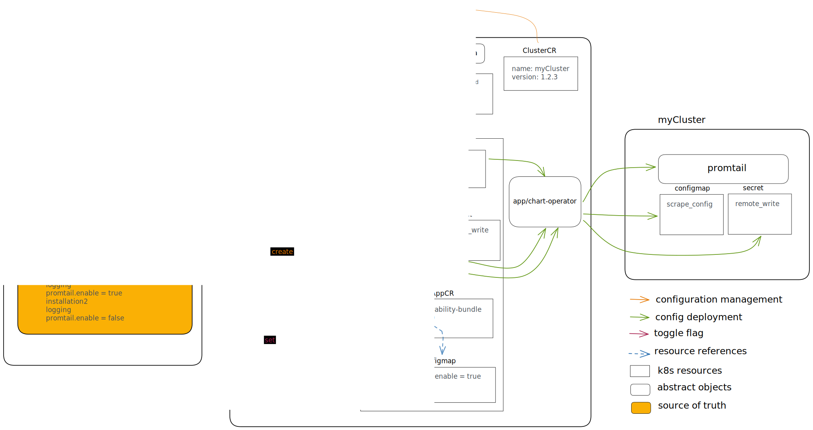

# Promtail config management

As a Giant Swarm engineer, I want to be able to deploy configuration for ingesting logs to all our cluster in a unified way.

## Context

Our logging infrastructure will rely on [Promtail](https://grafana.com/docs/loki/latest/clients/promtail/) to ingest logs. Promtail act as agent which collect logs locally from within the cluster and ship them to an external component for storage and processing.

After deploying Promtail we need to control 3 elements :

- The `scrape_config`, which describes how Promtail will discover targets to collect logs from.
- The `credentials`, for Promtail to be able to ship logs to Loki via the remote write API.
- The toggle flag, to enable/disable Promtail.

## Architecture

Here is a schema describing how the Promtail configuration is managed :

We have 3 distinct source of truth :

* `scrape_config`

   The Promtail scrape config is defined in the logging operator repository and wired to each cluster at runtime by the operator.

* `credentials`

   The credentials to access Loki are generated by the logging operator at runtime and configured where needed :
   - In the Promtail remote_write configuration: to push logs to Loki
   - In the Loki remote_write configuration: to receive logs from Promtail
   - In the Grafana Loki datasource: to read logs from Loki

* toggle flag

  The toggle flag is defined in the giantwarm/config repository, which give us the ability to enable and disable log ingestion per installation.

## Limitation

* Using the same `scrape_config` for all cluster regardless of provider and version. This has the benefit for us to deploy update easily. Also this should not be a problem regarding target discovery, learning from Promtheus scrape config we should be able to define a clear interface.
* toggle flag do not allow for individual cluster toggling, we can only enable/disable Promtail for all cluster of an installation. This can be improved later on.

