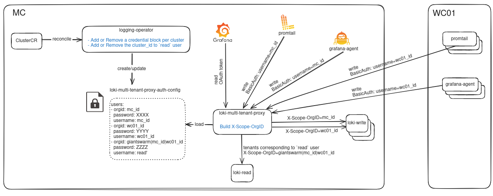
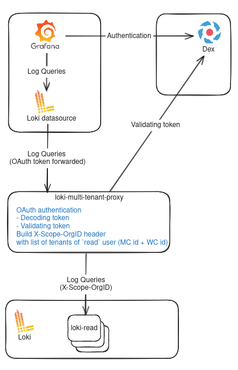
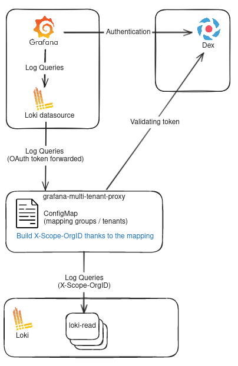

# Multi-tenancy for observability

## Glossary

- `tenant`: a group of users who share a common access with specific privileges to observability data
- `observability data`: all data related to metrics, logs, traces, profiles
- `read path`: path used by users to access observability data
- `write path`: path used by components to store observability data

## Introduction

Moving towards our observability platform, we have to consider two important topics.

First, we generate a lot of observability data.
For instance, we already reached our ingestion limits in Prometheus in the past and each new component we add brings a lot more metrics so we have to be mindful about the metrics we keep.
This issue got a whole lot bigger when we added logging with Loki to the mix.

Second, our product presently allows anyone with access to Grafana on the management clusters to access all the data (metrics and logs) for all workload clusters without any kind of data isolation or federation. This is part of the reason why only a subset of our customers (generaly only the platform teams) have access to our managed grafana and is also why our shared installation grafana is not accessible to customers.


As part of the developer platform, we want to be able to ingest all sorts of customer observability data. For example a lot of customers are interested in monitoring of application developers workloads. This will require Giant Swarm observability platform to be able to provide data isolation between tenants, so that customer teams have limited access to the data originating on clusters they own.

To that end, we now need to move towards multi-tenancy in our observability.

## Current situation

### Our Logging stack

Our logging solution Loki supports multi-tenancy based on a http header (`X-Org-ID`) and we already had to implement some basic form of multi-tenancy to be able to support the logs coming from our clusters.

The graph below shows our current implementation of the multi-tenancy on logs:



### Future of monitoring

We already have plans to migrate our monitoring stack to Grafana Mimir, which supports the same multi-tenancy mechanism as Loki. You can see the current status in this [epic](https://github.com/giantswarm/roadmap/issues/3039).

## What we want to achieve

We want to be able to segregate access to the observability data based on the user groups our customers have configured in their active directory.

But we also want to provide flexibility to customers to allow them to isolate their data as they want.
For instance, some customers may want to map:
- 1 tenant to 1 namespace
- 1 tenant to 1 cluster
- multiple tenants to 1 application (e.g. ingress controllers)
We would like to propose our customers the option of defining their tenants so that they can isolate the data as they want.

__Disclaimer:__ We might change this flexibility later on based on product (e.g. project CR) or operational decisions ( e.g. too many tenants).

In this document we will talk mostly about the logging implementation (with `Loki`) as this is where we are the more advanced, but we expect to share the same logic for all our observability stack components.

Because the read and write path for the multi-tenancy is technically different and have different requirements, we decided to split it into different sections.

## Read path

### Current architecture for the read path

Below is a graph exposing the current state of multi-tenancy:



The read path queries `loki` providing an `X-Scope-OrgID` header which contains the identifier (the `read` tenant) of all clusters: the management cluster plus all workload clusters.

### Configuring multi-tenancy on the read path

We have asserted that we can retrieve users groups through the OAuth token that is received from Grafana when we enable Oauth forwarding on the Loki datasource.

Below is an example of OAuth token content coming from Dex:

```json
{
  "iss": "https://dex.golem.gaws.gigantic.io",
  "sub": "XXXXXXX",
  "aud": "YYYYYYY",
  "exp": 1705661375,
  "iat": 1705659575,
  "email": "people@giantswarm.io",
  "email_verified": true,
  "groups": [
    "giantswarm-ad:giantswarm-admins",
    "giantswarm-ad:GS Support - MS teams",
    "giantswarm-ad:Giant Swarm Global",
    "giantswarm-ad:GiantSwarm",
    "giantswarm-ad:Giant Swarm EU",
    "giantswarm-ad:Developers"
  ],
  "name": "People People"
}
```

The component `loki-multi-tenant-proxy` which has now been renamed to `grafana-multi-tenant-proxy` should be configured with the mapping between groups of people and tenants

Below is a proposal of the configuration of the mapping between tenants and their assigned groups from the active directory:

```yaml
groups:
- name: giantswarm-admins
  tenants:
  - mc-name
  - wcdev-name
  - wcprod-name
- name: Developers
  tenants:
  - wcdev-name
- name: Ops
  tenants:
  - wcdev-name
  - wcprod-name
...
```

The mapping configuration should be dynamically created and updated regardless of the data source by an operator.
The operator would be able to reconcile any kind of data source and generate the configuration expected by `grafana-multi-tenant-proxy`.

Below is a graph exposing multi-tenancy proposal:



#### Operator management

`logging-operator` is an existing component responsible for creating a secret for the multi-tenant-proxy. That secret contains a mapping between credentials and tenant (it's currently equivalent to the cluster id).

We will have to either create a new operator to handle multi-tenancy for all observability tools (`observability-multi-tenancy-operator`) or add this feature into the `logging-operator` and rename it to `observability-operator`.

We are open to suggestions on this topic.

### Open questions

#### Teleport issue

We are currently facing an issue with `teleport` authentication:
[Teleport JWT issue](https://github.com/giantswarm/giantswarm/issues/29719)

We are authenticated on Grafana through a JWT token provided by teleport.
But that token is not forwarded to the datasource as this is not using the Grafana OAuth plugin to authenticate. Due to this, we cannot access the users groups in the grafana-multi-tenant-proxy.

We are considering a number of options that are not ideal at the moment:

- having double datasource: one for customer with OAuth authentication and another dedicated to GiantSwarm people authenticated throw teleport.
- having double grafana (same idea than above but for the all grafana instance, not just the datasource).
- share an authentication secret via cookies.
- other ideas are welcome!

#### Mapping user's groups to tenants

What interface could we offer our customers to enable them to define the mapping between their groups and their tenants:

- Custom resources like TenantCR, GroupCR
- UI in happa
- other ideas ?

## Write path

### Current architecture for the write path

On the write path, we currently use promtail to collect container and machine logs and grafana agent to collect kubernetes events.

We currently need those 2 tools because:
1. Promtail cannot get kubernetes events
2. Grafana Agent is going through quite a big rewrite in it's configuration and all features we needed were not supported when we deployed it

The flow is like this:
1. The logging-operator creates a `password` for the cluster's logging agents to be able to send logs to Loki and configures them (actual configuration of what to scrape and so on) via an extra-config.
2. The logging-operator adds the new cluster_id/password pair to the proxy configuration
3. The logging agents collect and send logs to the loki-multi-tenant-proxy which validates the basic authentication sent in the http header and transform it into a tenant information (X-Scope_OrgID)
4. Loki writes the data to storage for the configured tenant (cluster_id in that case)

### Configuring multi-tenancy on the write path

#### Different tenant configuration options

After a few different customer calls, we find out that they have different needs when it comes to multi-tenancy.

##### Cluster == Tenant

This is the approach we are currently using for technical reasons. We do not think this would match with customers workload as they mostly have a lot of customers sharing clusters.

##### Namespace == Tenant

This approach makes it really easy for us and customers to configure tenants and it would definitely be easy to onboard teams (e.g. adding a label on the namespace would make the agents collect logs from the containers in the namespace).

But this approach brings a few questions:
1. What tenancy should common internal apps use (e.g. prometheus-operator, api-server, cilium logs are accessed by multiple internal teams)? Do we need to ensure customers are putting those apps into a namespace accessible by all?
2. What about teams that share namespaces?

##### App == Tenant

This approach is especially flexible for customers but we do not think this approach makes sense because the mapping configuration would be impossible to maintain and we would probably face technical limits pretty fast

##### Hybrid mode

This approach would allow customers to be able to set the tenancy as they want (per namespace or per app depending on the use case).

#### Implementation details

The implementation details are at this stage are still an open topic, because no single tool fulfills all of our requirements. Until this RFC we use two tools, grafana-agent and promtail, which are bot not yet feature complete.
One preferred alternative would be [PodLogs](https://grafana.com/docs/agent/latest/operator/api/#podlogs-a-namemonitoringgrafanacomv1alpha1podlogsa), the equivalent of a Service or PodMonitor for metrics, but the existing implementation at the time of this RFC is not yet fully compliant with our needs as well.

We envisionned different distinct approaches here:

#### Approach 1: Customers provide their logs themselves

In this approach, based on the tenant information that the customer provided to us, we would generate a user/password pair that the customer would then use in their favorite log shipper to send their logs to Loki.

Pros:
- This is quite easy for us to implement as we already have the password generation logic
- We allow customers to use the tool they know and love.
- We will not receive pages if the tool is not working properly

Cons:
- This is far from the idea of a platform
- There is a high risk that configuration will be messy and hard for use to debug when we need to

This approach might be useful for customers that want to send logs from outside the clusters

#### Approach 2: Extract tenant information from a label/PodLog

Existing logging agents support setting the tenant to send to loki using a custom log label.
We can configure our logging agents to get the logs of specific namespaces/pods if they have a label like `giantswarm.io/tenant: my-tenant` or using a PodLog CR (if applicable).

Pros:
- Quite easy to configure for logs

Cons:
- Tenant configuration will need to be configured in multiple places (MC for the read path and WC for the write path)
- Label approach would most likely not work for metrics OOTB (this would require customer to add new labels like metrics port, path and so on).

#### Approach 3: Configure promtail based on the MC tenancy CR

Altough the customer UX for the read path is still unclear, we can envision a CR like a Tenant CR that would map user's roles to namespaces/deployment under a given tenant name. The logging operator would then take care of applying all that logic

Pros:
- Everything is happening on the MC and it could map to the Project CR concept that has been talked in Product for a while.

Cons:
- MC needs to be aware of the state of all WCs (has all namespaces and so on). How can customers be sure they have all logs?

#### Approach 4: We enforce 1 namespace == 1 tenant with possibility of opting out

It is quite easy to configure 1 tenant per namespace in our current setup and we could use a giantswarm.io/logging: false on specific namespace or containers to not get the logs.

Pros:
- Customers would only have to fill out the read path configurations (unless they want to opt-out a lot)
- With this approach, we could still have a `giantswarm.io/tenant: my-tenant` label on some apps that should have a specific tenant attached to them.

Cons:
- Our existing customers want to start slow (team by team) and opting-out for all namespaces from the start will be a hassle. An idea to avoid this would be to be able to opt-out of the multi-tenancy features with a cluster label (`giantswarm.io/tenancy: false`).

### Open questions

- How do we handle managed apps logs? We are currently not able to only get specific logs for managed apps in workload clusters as we only get logs from the giantswarm and kube-system namespaces.
- What is the danger of being to open in customer custom configs?
- How do we managed out of cluster logs? (this might come up)
- What about data retention? Should we allow custom retention per tenants? If yes up to how long?
