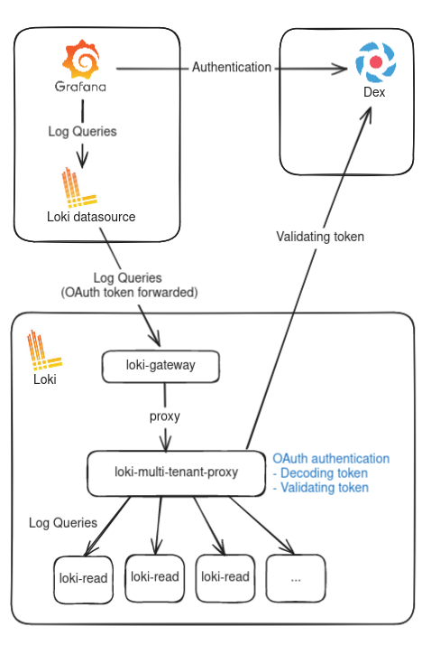

# Multi-tenancy proposal

## Introduction

Since we have a logging infrastructure, we are thinking about the multi-tenancy.
The observability stack with metrics, logs, traces is treating a lot of data.
According the role of people, some data must be accessible or not.
We would like to propose our customers the option of defining their tenants so that they can isolate the data as they want.

Our product currently allows anyone with access to Grafana to request all the data: metrics and logs.
Those datas are written with a tenant id that corresponds to the cluster id.

Our idea of multi-tenancy is to be able to isolate data by tenant. A tenant can be anything: a namespace, a cluster id, a group of people, a feature, etc.

We need to discuss how we handle multi-tenancy when accessing data (read path) and when sending it to object storage (write path).

## Read path

Below is a graph exposing the current state of multi-tenancy:

## Write path
