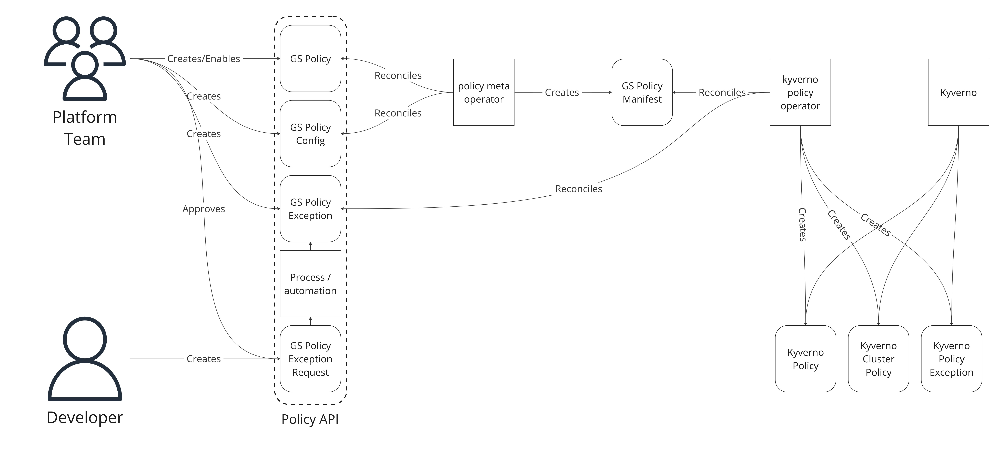

# Policy Orchestration System

> [!NOTE]
> :bulb: This RFC describes a subsystem of the security platform which is an intended long-term approach to improving policy management.

## :beginner: Current state / context

Giant Swarm manages several third-party applications which provide security features to our customers.

This management includes a set of default policies for each tool, which we recommend, deploy, and manage based on the perceived value for most / all customers.

Customers using these tools often create additional policies, or make modifications to the provided policies, in order to better fit their organization's risk appetite or internal processes.

Commercial tools exist which combine the different types of security tools into single agents or logical platforms. These typically have their own proprietary interface for managing policies, exceptions, and security workflows.

There is ongoing work upstream to standardize policy management, but it is not yet robust enough to address the pain points targeted by the approach described here.

## :triangular_flag_on_post: Problem space

The top pain points with the current state of policy management using the security platform are:

- If Giant Swarm changes the implementation of a policy, customers may need to adapt workloads, processes, monitoring, etc. to conform to the new tool.
- Adoption of new or changed policy logic within a given tool can be labor-intensive even though the customer's intent has not changed.
- More generally, customers have too much required toil to use even the Giant Swarm-provided apps and policies.
- There is overlap between policy logic between tools as well as with other non-security-focused parts of the platform. These must currently be configured and managed separately, duplicating work and sources of truth.
- Existing tools in the open-source space do not provide a unified way to reflect the administrators' intent for policy enforcement or exceptions.

### Implementation-specific technical examples

> [!IMPORTANT]
> Only read this section if you're interested. This content is not needed to understand the next sections.

- Kyverno policies have two modes: `audit` and `enforce`. Resources which are exempt from enforcement of an `enforced` policy are also excluded from audits because they, by definition, are exempt from the policy. To audit them, a second, identical,`audit`-mode copy of the policy must be deployed. Further, some policies could be optionally defaulted to make incoming resources compliant. This requires a third copy of the policy. The 3 policy approach has technical side effects in metric names, reporting, and exceptions (e.g. the `enforce` policy must be exempted, but not the `audit` policy, in order to continue auditing the resource). An abstraction layer allows the customer to deal only with a single policy name and simplified options while we deploy the 3 policies and update associated exceptions behind the scenes.
- Kyverno policies written at the Pod level can have analogous policies automatically generated at the various Pod controller levels. This is useful so that a policy can be written only once for Pods, but users receive immediate feedback whether they are creating a Deployment, DaemonSet, StatefulSet, [Cron]Job, or just a Pod. But, each of those automatically generated policies must be individually excluded if a resource is to be exempt, and the exception must also include the other affected resource types. The abstraction layer can hide these implementation details and let customers use a simpler syntax for declaring exceptions, which we can also reuse in other tools.
- Kyverno and Falco both support "trusted registry" policies (among others). This information will also be needed by Harbor. All 3 can be configured from the same source of truth.
- It is currently necessary for customers to manually maintain a user values configmap in order to suppress vulnerability scan findings. This is error-prone and doesn't scale.
- Increased interest in supply chain security means the implementation of vulnerability scanning is likely to change. Ideally, this would happen transparently.
- Common security workflows include opening Jira issues, sending messages to Slack channels, or forwarding events to external services like Splunk or Elastic. These routes must currently be configured separately for Falco, Kyverno, Trivy, Alertmanager, Loki/fluentd, etc., but could be unified.
- Whenever a new, restrictive policy is introduced, customers must decide how to phase it in. If they enforce it immediately, all workloads must be made compliant or fail. If they introduce it in a permissive mode, it is very difficult to enforce later. Abstraction would allow us to implement "rolling" enforcement features like time-limited exceptions and logic like "existing workloads are exempt but new workloads must comply".

## 📈 Solution space

Possible approaches to this problem include:

- Do nothing. Giant Swarm could continue to manage clusters and security apps as we currently do and require customers to handle policy management in their clusters.
- Pay for a commercial product. We have explored multiple options in the past and could re-evaluate the current offerings.
- Adapt the existing App Platform to fit security use cases. The use cases are too different, in our opinion, to make sense combining in that way, and the future of that platform is unclear.
- Introduce an abstraction layer on top of the policies Giant Swarm chooses to manage. This is described in the rest of this RFC.

## :exclamation: Risks

1. We waste time implementing un- or underutilized features.
2. A new community project supersedes our work. (We would celebrate this risk materializing.)
3. Our policy orchestration introduces new vulnerabilities which reduce the effectiveness of the tools.

## :feet: Implementation

> [!NOTE]
> We intend to build a new subsystem which allows customers to declare their intent to enforce/disable/exempt resources from policies on their clusters and transforms that declared intent into the resources and configuration needed to achieve the intent in the underlying tools.

> [!IMPORTANT]
> Non-goal: We are not building a policy language. This abstraction does not allow writing arbitrary policies which are "translated" into the underlying tools' native syntax.

> [!IMPORTANT]
> Non-goal: this does not prevent customers from writing their own policies directly for the managed tools.

The policies supported by this abstraction are a limited set of curated policies which Giant Swarm intends to manage. The abstraction allows customers who only need the officially managed policies to work exclusively within our abstraction layer and never interact with the underlying implementations.

It provides a clear delineation between customer and Giant Swarm areas of responsibility.

### :small_blue_diamond: Flow

Example of the flow for configuring Kyverno-native resources using the policy orchestration subsystem:


### :small_blue_diamond: Design

We introduce the following new Custom Resource Definitions (working titles, specs TBD following RFC feedback).

Under the Group `policy.giantswarm.io/`:

- `Policy` - represents a specific constraint or configuration for which Giant Swarm manages the implementation(s). A customer deploying and enabling a particular Policy indicates the intent for the described behavior to be configured in the cluster.
- `PolicyConfig` - contains user-provided configuration for a specific Policy. For example, a configurable threshold for a value.
- `PolicyManifest` - a system-internal type containing the combination of implementation-specific policies which implement a Policy, along with any configured values used by the policy logic. Informs the downstream controllers which specific policies should be deployed. (alternative name suggestions welcome)
- `PolicyException` - represents a specific case where the customer intends *not* to apply a Policy. Includes a reference to a Policy and a resource or group of resources which are exempt. This supports intentionally limited selection logic, at least in early versions.
- `PolicyExceptionRequest` - represents the un-validated intent of a user to exempt a workload from a policy. Facilitates building request/response workflows.
- `PolicyExceptionDraft` - represents a possible implementation of a `PolicyException`, which is awaiting review and approval from a cluster admin. Generated by platform controllers to automatically suggest exceptions to assist with migrations or phasing in new policies. `PolicyExceptionDraft` and `PolicyExceptionRequest` are very similar and may be combined into a single type for actual implementation.

Additional types have been considered but would not be implemented until a need arises:

- `PolicySet` - represents a named collection of Policies, analogous to an App Catalog. May simplify logical groupings of, for example, default Policies, best practices policies, SOC policies, or other independently-managed combinations.
- `PolicySource` - represents a place from which policies may be retrieved, like a git repo, OCI registry, or configmap.

We expect to eventually implement the following operators to support the behavior (obligatory "naming things is hard, we'll iterate"):

- `policy-meta-operator` reconciles `Policy` and `PolicyConfig` CRs and creates `PolicyManifest` containing the list of specific policies to be deployed, along with any data to be used in policy parameters.
- `<implementation>-policy-operator` - an implementation-specific operator which reconciles `PolicyManifest` and `PolicyException` CRs and configures the underlying tools.
  - Example: `kyverno-policy-operator` - ensures the requested policies are present on the cluster and generates Kyverno-flavored PolicyExceptions based on the Giant Swarm PolicyExceptions.

### :small_blue_diamond: Specs

> [!IMPORTANT]
> These are partial specs only for illustration.

#### Policy

`Policy` - represents a specific constraint or configuration for which Giant Swarm manages the implementation(s).

```yaml
apiVersion: policy.giantswarm.io/v1alpha1
kind: Policy
metadata:
  name: require-trusted-image-registries
spec:
  mode: "[enforce|audit]"
  mutate: false
  args:
    registries:
      type: list
status:
  valid: true
  ready: true
  policyStates:
  - type: "kyverno"
    name: "require-trusted-registry"
    ready: true
  ...
```

#### PolicyConfig

`PolicyConfig` - contains user-provided configuration for a specific Policy. For example, a configurable threshold for a value.

```yaml
apiVersion: policy.giantswarm.io/v1alpha1
kind: PolicyConfig
metadata:
  name: some-trusted-registries
  labels:
    policy.giantswarm.io/policy: "require-trusted-image-registries"
spec:
  policy: "require-trusted-image-registries"
  registries:
  - my.company.registry.local
  - my.other.company.registry.local
status:
  ready: true
```

Additional `PolicyConfigs` for the same `Policy` with the same `arg` would be combined, if valid for the type:

```yaml
apiVersion: policy.giantswarm.io/v1alpha1
kind: PolicyConfig
metadata:
  name: another-trusted-registry
  labels:
    policy.giantswarm.io/policy: "require-trusted-image-registries"
spec:
  policy: "require-trusted-image-registries"
  registries:
  - a.very.different.registry
status:
  ready: true
```

Resulting in final arguments to the policy:

```yaml
registries:
- my.company.registry.local
- my.other.company.registry.local
- a.very.different.registry
```

#### PolicyManifest

`PolicyManifest` - a system-internal type containing the combination of implementation-specific policies which implement a Policy, along with any configured values used by the policy logic.

```yaml
apiVersion: policy.giantswarm.io/v1alpha1
kind: KyvernoPolicyManifest
metadata:
  name: require-trusted-image-registries
  labels:
    policy.giantswarm.io/policy: "require-trusted-image-registries"
spec:
  mode: "enforce"
  mutate: false
  args:
    registries:
    - my.company.registry.local
    - my.other.company.registry.local
    - a.very.different.registry
status:
  valid: true
  ready: true
```

At this point, the policy would be enforced, requiring all workloads to pull images from one of the named registries.

#### PolicyException

`PolicyException` - represents a specific case where the customer intends *not* to apply a Policy.

```yaml
apiVersion: policy.giantswarm.io/v1alpha1
kind: PolicyException
metadata:
  name: my-workload-registry-exception
  namespace: my-workload-ns
  labels:
    policy.giantswarm.io/policy: "require-trusted-image-registries"
    policy.giantswarm.io/valid-until: "2024-01-01"
    policy.giantswarm.io/workload-last-seen: "2023-08-15"
spec:
  policy: "require-trusted-image-registries"
  targets:
    - namespaces:
      - my-workload-ns
      deployments:
      - my-workload
  # potential feature: permitted values instead of a blanket exception.
status:
  valid: true
  ready: true
  policyStates: # Need a better name here. This list references the implementation-specific resources created for this exception.
  - type: "kyverno"
    name: "my-workload-ns-my-workload-require-trusted-image-registries-exception" # Or a ref to the Kyverno PolicyException.
    ready: true
  ...
```

Using `PolicyExceptions`, cluster admins can exclude certain resources from policy enforcement.

#### PolicyExceptionRequest / PolicyExceptionDraft

`PolicyExceptionRequest` - represents the un-validated intent of a user to exempt a workload from a policy. Facilitates building request/response workflows.
`PolicyExceptionDraft` - represents a possible implementation of a `PolicyException`, which is awaiting review and approval from a cluster admin. Generated by platform controllers to automatically suggest exceptions to assist with migrations or phasing in new policies.

`PolicyExceptionDraft` and `PolicyExceptionRequest` are very similar and may be combined into a single type for actual implementation.

```yaml
apiVersion: policy.giantswarm.io/v1alpha1
kind: PolicyExceptionRequest
metadata:
  name: my-workload-registry-exception
  namespace: my-workload-ns
  labels:
    policy.giantswarm.io/policy: "require-trusted-image-registries"
    policy.giantswarm.io/valid-until: "2024-01-01"
    policy.giantswarm.io/workload-last-seen: "2023-08-15"
spec:
  policy: "require-trusted-image-registries"
  targets:
    - namespaces:
      - my-workload-ns
      deployments:
      - my-workload
  # potential feature: permitted values instead of a blanket exception.
status:
  phase: PendingApproval
  valid: true
```

Using `PolicyException[Draft|Request]s`, we and customers can built additional automation and approval workflows.

Customers have varying current practices around this - some use in-house portals where developers request exceptions through a UI. Others manage them via a PR workflow in git. Others have additional approaches.
These resources exist to declaratively capture suggestions from the platform itself and requests from users or other automation. They are then sent to approval and ideally signature workflows before becoming actual exceptions.

## 💬 Open Questions

1. Should all Policies be pre-installed in clusters and some disabled by default? Or should customers deploy and enable them only if they choose?
2. The names overlap with upstream/external names. Perhaps equally descriptive but non-overlapping names can be found.
3. Should `PolicyManifest`s be implementation-specific? e.g. `KyvernoPolicyManifest`. Or should a single manifest include all downstream implementations?
4. How should we store the metadata needed to map high-level policies with their implementations? Metadata in policy source repos? Another custom resource?
5. How/whether to represent the arguments to policies? Policies might accept lists of acceptable values versus a single acceptable value, for example. These will need to be handled.
6. How much flexibility is needed in `PolicyConfig` combinations? Is a simple additive system sufficient, or do we need to eventually support canceling out other configurations?
7. Are there community tools which replace the need for any part of this system (our research says no)?

### :small_blue_diamond: Reviewer requests

By area:

- Architecture - what are the problems with this approach, based on what we've learned from App Platform, etc.?
- AE - Are there customer needs that still aren't met by this approach (even if not explicitly listed)?
- Product - Is there any similar work being done elsewhere in the platform? Are there immediate non-security use cases we should consider for inclusion in this platform?
- All: Does this make sense? Could we achieve the same goals with less Giant Swarm-specific work?
