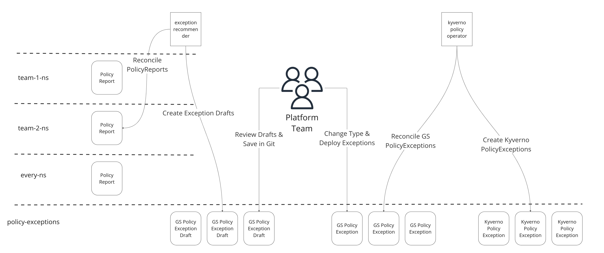

# PSS migration assistance

> [!NOTE]
> :bulb: This RFC describes a minimal implementation of a small piece of the policy orchestration subsystem described in a parallel RFC. It is designed to meet an immediate need as customers begin PSS migration but will be adapted to meet the more general needs outlined in the linked RFC.

## :beginner: Current state / context

PSP has been deprecated and replaced in Giant Swarm clusters with Kyverno PSS policies.

This change means customers must change the way they handle exceptions to policies for resources which are not compliant.

This effort is highly variable depending on the way the organization manages exceptions and the current state of compliance.

We intend to introduce a new CRD and build two new controllers, based on our larger policy orchestration concept, but initially with highly migration-specific logic, to automate most of the toil for PSS migration.

## :triangular_flag_on_post: Problem space

:::success
Describe the problems your users are expecting to solve.
:::

For various reasons, customers may find that the move to PSS involves significant effort.

- At minimum, resources which were permitted under PSP will need to receive Kyverno exceptions if they are to continue running
    - Platform teams or workload owners will need to create a new exception per failing resource
    - There is a slight learning curve to creating Kyverno PolicyExceptions
    - With many workloads requiring exceptions, this is either a large task done centrally or smaller tasks coordinated across many teams
- Per organizational policy or implementation reasons, teams may need to re-apply for previously approved exceptions

## 📈  Solution space

:::success
Collect ideas that may solve the problems here.
:::

Some approaches to ease the PSS transition are:

- Documentation. We have produced multiple rounds of instructional PSS-related content, but this does not ultimately reduce the effort of actually applying those instructions
- Dashboards / reports. In addition to the native reports, we operate global dashboards for as much of the adoption status as possible, and have deployed a Kyverno UI per-cluster for use in identifying failing workloads. However, these also do not eliminate the manual touches needed for customers to actually assume management of the new exceptions.
- Generation of exceptions from PSPs. This approach was attempted with partial success. However, the policies are not a perfect 1-1 match, and there are policies in PSS which do not have direct equivalents in PSP, so there remains some ambiguity and customer decision required for their enforcement.
- Generate Kyverno exceptions from PolicyReports. This has also been trialed, with success. It is possible to simply generate an exception satisfying every failing policy for a given workload. However, this introduces two problems. First, without some review, it potentially grants more permissions than intended by the cluster admins. Additionally, since there is no backing source for the PolicyException, the workload will abruptly stop working at some point after its exception is removed. The PolicyExceptions must be properly managed in a deployed resource which will re-apply them in the future.
- Generate Kyverno PolicyExceptions for customer administrators to manage. Instead of directly applying the Kyverno PolicyExceptions, we considered generating them as an alternative type with an identical spec, which cluster administrators could then store or distribute to workload teams as they choose. This would solve the immediate adoption limitations. However, to avoid hitting this issue again in the future, we hope to do slightly better.
- Generate recommended generic exceptions for customer administrators to manage. Instead of directly creating the Kyverno PolicyExceptions, we instead generate an intermediate resource which customers can store or distribute to workload teams, and which separates the cluster admin's intent from the underlying implementation. This is the approach described in the rest of this RFC.

## :exclamation: Risks

1. The generated exceptions could be over-permissive. We actually expect this, and are working on a separate initiative to tighten down over-permissive exceptions in the future. We believe we can undertake this work only for purposes of migration, given that the generated exceptions will represent the current state of clusters secured with PSPs. By definition, the presence of a workload means that the resource has been approved and any current risk has been accepted by the customer, since their currently configured policy allows it. In the future, when PSS is the standard, we may not be able to make this assumption when changing policy implementations. The proposed process keeps customer admins in the loop, and they could elect to honor generated exceptions only from certain clusters, or from certain environments.
2. This implementation could be too complicated, or we are not fast enough at implementing it. This is entirely possible. We think about this two ways. 1. There is upfront process work to be done by the customer, and without the automation recommending exceptions, it is unlikely that customers move very fast anyway. Any work done while we are implementing this capability is not wasted, and the recommendations can be used to accelerate adoption later on. 2. taking the time now to get customers directly to what we expect to be the future is preferable to trying to get them to repeat this effort again later.
3. Probably others, we're moving pretty fast.

## :feet: Implementation

> [!NOTE]
> This implementation includes new resource types outlined in a parallel RFC. We will only implement the minimum necessary to carry out the migration now.

### :small_blue_diamond: Flow

Example CR flow:

The intended workflow is:

- (v19.1.x) security bundle containing this implementation is installed
- `exception-recommender` generates one `PolicyExceptionDraft` per-workload with failing policies in the `policy-exceptions` namespace
- cluster admins retrieve the `PolicyExceptionDrafts`
- cluster admins review the generated exceptions, and, if they accept them, store them in a git repository as Giant Swarm PolicyException resources
  - according to their preference and security policies, customers may adopt different processes here, like distributing PolicyExceptions to workload owners
- GS PolicyException resources are deployed to the cluster through a gitops or other appropriate workflow
- `kyverno-policy-operator` reconciles the deployed Giant Swarm PolicyExceptions, and renders a corresponding Kyverno PolicyException in the `policy-exceptions` namespace
  - this results in the failures disappearing from the PolicyReport, which results in the deletion of the original PolicyExceptionDraft. The workload's exception is now customer-managed, via the Giant Swarm PolicyException.
- when no failing resources remain, the cluster is upgraded to v20.0.x

Customers will need an ongoing process to manage future exceptions. Shield is producing additional content recommending a workflow which follows currently understood best practices.

### :small_blue_diamond: Design

We plan to introduce a new Custom Resource Definition and two controllers.

Under the Group `policy.giantswarm.io/`:

- `PolicyExceptionDraft` - represents a possible implementation of a `PolicyException`, which is awaiting review and approval from a cluster admin. This type is described in context in the parallel RFC.

We expect to build two operators to support migration, which will be re-purposed in later versions:

- `exception-recommender` - generates potential PolicyExceptionDrafts for workloads from currently failing policies. In the future, we plan to use this operator to help phase in new policies, but for now the logic will be limited.
- `kyverno-policy-operator` - generates Kyverno-flavored PolicyExceptions based on the Giant Swarm PolicyExceptions. In the future, this controller will also deploy and configure other Kyverno resources (see policy orchestration RFC).
