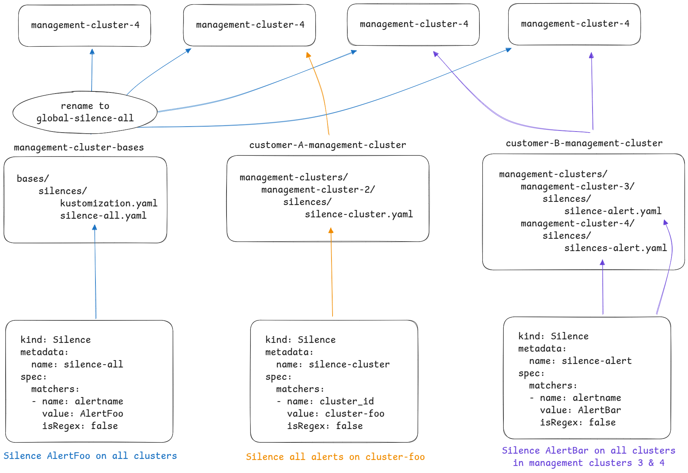

# Deploy observability silences using GitOps

The Observability Platform makes use of [Silences](https://github.com/giantswarm/silence-operator/#how-does-it-work) CRs in order to mute alerts, see [silences management](https://intranet.giantswarm.io/docs/support-and-ops/processes/silence-management/).

Those Silences CRs are currently stored in a private Github repository at [https://github.com/giantswarm/silences][1], where GiantSwarm employees can create and manage silences. They are deployed to management clusters via a CronJob which pulls Silences CRs from the Github repository.

## Problem statement

The current deployment solution using a CronJob suffers from both privacy and security issues and does not allow customers to manage their silences. It is also not in line with any of the deployment mechanisms we currently have in place.

## Solution proposal

This solution proposes to re-use the current [management-cluster-base][2] (MCB) and customer management cluster (CMC) (e.g. [giantswarm-management-clusters](https://github.com/giantswarm/giantswarm-management-clusters)) GitOps mechanism in place in order to manage and deploy Silences CRs accross management clusters.

This solution is laid out as follows:

- Silence CRs common to all clusters are stored in the MCB repository, under the `bases/silences/` directory
- Silence CRs added in MCB also need to be referenced in the `bases/silences/kustomization.yaml` file
- Silence CRs specific to a cluster are stored in the corresponding CMC repository, under the `management-clusters/<management-cluster-name>/silences/` directory
- Name collision between MCB and CMC Silences CRs is prevented by adding the special `common-` name prefix when deploying Silences CRs from the MCB repository



### Examples

- Common Silence CR in MCB repository:

```yaml
$ cat management-cluster-bases/bases/silences/alice.yaml
apiVersion: monitoring.giantswarm.io/v1alpha1
kind: Silence
metadata:
  name: alice
  annotations:
    valid-until: "2100-01-01"
spec:
  matchers:
  - name: alertname
    value: AliceAlert
    isRegex: false
```

```yaml
$ cat management-cluster-bases/bases/silences/kustomization.yaml
resources:
- alice.yaml
```

- Cluster specific Silence CR in CMC repository:

```yaml
$ cat giantswarm-management-clusters/management-clusters/some-management-cluster/silences/bob.yaml
apiVersion: monitoring.giantswarm.io/v1alpha1
kind: Silence
metadata:
  name: bob
  annotations:
    valid-until: "2100-01-01"
spec:
  matchers:
  - name: alertname
    value: BobAlert
    isRegex: false
  - name: cluster_id
    value: some-cluster-id
    isRegex: false
```

### Use cases

- Create a silence for all clusters
  - Add the Silence CR to MCB repository in `bases/silences/` directory
  - Reference the new Silence CR in the `bases/silences/kustomization.yaml` file

- Create a silence for a single cluster
  - Add the Silence CR to the `management-clusters/some-management-cluster/silences/` directory
  - Add a matcher for the `cluster_id` tag with the cluster ID as value in the Silence CR

- Create a silence for multiple clusters in a single management cluster
  - Add the Silence CR to the `management-clusters/some-management-cluster/silences/` directory
  - (Optionally) Add a matcher for the `cluster_id` tag with all cluster ID as regex value in the Silence CR

- Create a silence for multiple clusters in a multiple management clusters
  - Add the Silence CR for each desired management cluster in `management-clusters/<each-management-cluster>/silences/` directory
  - (Optionally) Add a matcher for the `cluster_id` tag in the Silence CR

### Benefits

- Silences are deployed and managed using standard GitOps mechanisms
- Customers can manage their own silences
- Fixes current privacy and security issues

### Drawbacks

- Rather than using the `targetTags` field to define where the Silence CR is deployed, user now needs to duplicate the Silence CR for each management cluster it needs to be deployed to

### What changes

- Move Silences CRs from the [silences][1] repository to MCB and CMC repositories
- Deprecate and archive the [silences][1] repository

## Links

- [1]: https://github.com/giantswarm/silences
- [2]: https://github.com/giantswarm/management-cluster-bases
