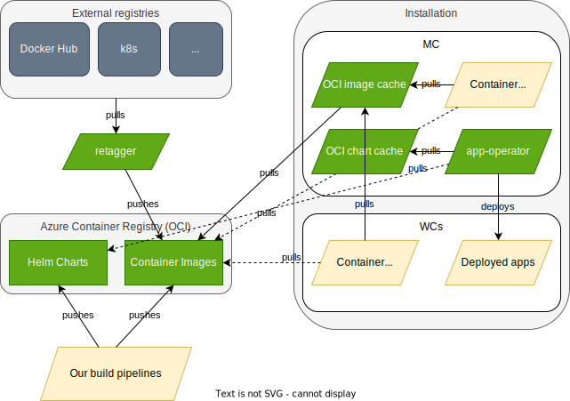

# Leaving docker hub and simplifying registries architecture

## Date created

03.10.2023

## Last modified

03.10.2023

## Authors' emails

<lukasz@giantswarm.io>

## Intro

We decided to leave docker hub by the end of 2023, as their pricing policy and negotiation style is no longer acceptable
for us.

Additionally, our current registry setup is quite complex. We use multiple registries (quay, docker hub, Azure Container
Registry [ACR]) for container images. We use different backends for container images and for helm charts. As a result,
we have to run synchronization tools to move stuff and replicate across our different registries. For more info and
diagrams showing how the current solution works, please see
[here](https://handbook.giantswarm.io/docs/product/architecture-specs-adrs/specs/registry-mirror/#how-are-images-synchronised-between-registries).

While switching away from Docker Hub, we would like also to simplify the architecture, which now involves multiple registries and caring for replication across them. The main reason we started to use replicated registries was
a requirement of one of our former customers. While this has some benefits in terms of reliability, it also brings
complexity and cost of running
the synchronization software on our side. We want to offload the problem of High Availability to a registry provider and
not to handle it ourselves. To protect us from potential service provider down time or networking issues, we will run a
local pull-through proxy. This solution should also limit the cost of the remote registry a lot.

One important implication of the proposed change is how it affects our customers. Since now we use the paid subscription
for Docker Hub, we log in all the container runtimes on all the nodes using our docker hub credentials. This makes
customers use our subscription to download any images from docker hub: ones that are needed to run our infrastructure,
as well as any other. After switching to a new architecture, we will care for availability of our images, but leave
customer's images in the default configuration. This means, that they can start hitting rate limiting where previously
nothing like that happened. It also means that they might want to configure their own registries in the container
runtimes to work around this issue.

Using this approach, we will be able to simplify our architecture, limit the cost (Docker Hub is expensive and gets worse)
and keep HA properties of our infrastructure.

### Specific problems and goals to solve

More specifically, our aim is to:

- Stop using Docker Hub by the end of 2023.
- Simplify registries architecture.
- Switch entirely to OCI based registries for both container images and helm charts.
  - Flux developers have already declared that no new feature will come to Flux for users of HTTP-based repos, only for OCI. 
  - Currently, we use a mix of HTTP and OCI repos, but chart discovery uses HTTP-based ones only.
- If possible, switch to single OCI provider.
- Increase availability and lower the network transfer cost by providing a pull-through cache service.
- Automatically clean old dev release artifacts.
- If possible, use the registry provider to replicate registries between Europe and China.
- Use a solution, that works natively with `containerd` and `helm` and doesn't need tricks like mutating webhooks,
  that change Pod's image.

## Proposed solution

The target architecture would look like below (dashed lines for pull actions mean fall-back registries):

Please note, that instead of a per-MC cache instance, we might want to run just one cache per cloud provider's region.
Check the discussion [below](#open-questions).

### Choosing OCI repository provider

We checked for the single best registry and chose ACR. We did some evaluation before and you can read results here:

- <https://github.com/giantswarm/roadmap/issues/2382>
- <https://hackmd.io/gqF6PT53RcG_i4OhrmtWIw#Note-on-compatibility>

Additionally, ACR offers the following:

- High availability by definition.
- Automatic geo-replication, including geo-replication between Europe and China (confirmed by Azure support, requires
  going through a formal process, though).
- Automatic retention
  - When enabled, manifests that don't have any associated tags (untagged manifests) and are not locked, will be
    automatically deleted after the number of retention days specified. [Docs](https://learn.microsoft.com/en-us/azure/container-registry/container-registry-retention-policy).
- Best-in-class support for the OCI standard (it's MS that is pushing it forward).
- Reasonable pricing
  - price per region €1.540/day (500 GB included), then €0.003/GB/day + traffic fee
  - [Azure cost calculator](https://azure.microsoft.com/en-us/pricing/calculator/?service=container-registry)

### Choosing caching solution

There are at least a few solutions possible, below is a list of solutions evaluated:

- <https://goharbor.io>
  - Seems very complex to run, just [the list of needed components](https://goharbor.io/docs/2.2.0/install-config/) scares
    me off. We want a simple cache, not all the bells and whistles with a ton of components we have to keep running.
- <https://github.com/enix/kube-image-keeper>
  - seems to support container images only, works by a webhook rewriting pod's image - doesn't meet assumptions.
- <https://gitlab.cronce.io/foss/oci-registry>
  - OCI compliant, works with `containerd` by registering as a mirror, no webhooks, optional S3 storage - seems
    like exactly what w need.
  - Tested it, but I unfortunately [couldn't make it work](https://github.com/mcronce/oci-registry/issues/14) even for a simple test case, doesn't seem to be well supported.
- [ACR connected registry](https://learn.microsoft.com/en-us/azure/container-registry/intro-connected-registry)
        - there's no mention of how to deploy outside of AKS edge cluster, seems Azure IoT edge thing only
- [docker's distribution/distribution](https://github.com/distribution/distribution)
  - one instance can proxy only for a single upstream registry (but that's OK for us)
  - tested, works with `containerd` for single upstream repo, works as well with `helm` charts
  - no extra dependencies, can work with just local filesystem storage
  - exposes reasonable prometheus metrics (transfer times, cache hit ratio)
  - <https://github.com/distribution/distribution/blob/main/docs/configuration.md#proxy>
  - <https://github.com/docker/docs/blob/main/content/registry/recipes/mirror.md>

As a result, it seems we can use the `distribution` project from docker.

## Implementation notes

Very short and brief implementation idea. We can plan more details once we agree on the idea and solution.
To keep the migration simpler, we split it separately for the container images and for the helm charts cache.
We want to start with the images cache, as that's what we currently use Docker Hub for.

### Container images

Currently, we use two ACR registries, `giantswarm` for container images and `giantswarmpublic` for helm charts.
The images one is already over 4 TB in size and it will be hard to clean it up. We can instead start with a new
empty repo and populate it using a separate instance of `retagger`. We won't start uploading build artifacts there
before we figure out how to use the retention policy.

High level migration plan:

- bootstrap a new ACR registry for images, let's call it tentatively `gsoci`
  - configure access, geo-replication and a retention policy for the repo
- prepare and deploy `distribution` cache instance, configure it for the new repo
  - ensure monitoring and alerting
- switch our CI/CD pipelines to not tag dev build artifacts
  - use a tool (`skopeo`, `retagger`?) to replicate all (do we really need all?) the tagged versions of images we build from the old `giantswarm` repo to the new `gsoci`
  - configure CI/CD so it uploads to both the old `giantswarm` and the new `gsoci`
- deploy a new instance of `retagger` that will replicate all the configured public images to the new `gsoci` registry
- switch container runtimes to use the cache as a source of images and upstream `gsoci` as a fallback
- cleanup (after some time)
  - delete our registries in docker hub and quay
  - delete the old `giantswarm` registry in ACR
- for this part, we keep China registry unchanged
  - we reconfigure the `crsync` to replicate images from `gsoci` to `aliyun` in China

#### China extension

- we try to setup automated geo-replication between Europe and China
- switch China clusters to use the new ACR-China registry
- shut down `crsync` entirely
- delete Aliyun registry

### Helm charts

The blocker for switching Helm Charts entirely to OCI is currently our artifact discovery process, which uses the
`index.yaml` file, that is available in HTTP based Helm registries only. So, to get started, we have to switch our
discovery process to OCI based one. Currently, we're already uploading our build artifacts to both HTTP and OCI repos,
so nothing is blocking implementation and a switch.

High level migration plan:

- prepare and deploy `distribution` cache instance, configure it for the upstream ACR registry
  - ensure monitoring and alerting
- switch our CI/CD pipelines to not tag dev build artifacts
  - we want to use retention policies for helm charts as well
- implement changes in the `app-operator`
  - use OCI discovery instead of `index.yaml` from HTTP registries
  - (optional) solve the problem of presenting only X (by default 5) most recent versions in the ACE CR
  - introduce a concept of primary and fall-back registry
- stop uploading charts into HTTP registries
- reconfigure `app-operator` to use the OCI cache as the primary registry and upstream ACR as fallback
- cleanup HTTP registries
- handle China as for images

## Open questions

Before we start on the implementation, we have to figure out answers to questions below:

1. Should we use a single cache instance per installation, or rather per cloud provider + region?

   The disk requirements for a cache might be significant and as a result cost of running an instance per MC can be quite
   high in total. Additionally, we can expect many of the images to be the same for all clusters (MCs and WCs) that run
   for the same provider. So, it seems running a single instance of the cache per cloud provider can be both much cheaper
   and also more efficient and performant.

1. How to not tag dev builds?

   ACR has a neat new feature that allows for automatic cleanup of untagged artifacts after a certain period. Currently,
   we upload a ton of dev build images. This feature allows us to clean them up automatically, with zero effort on
   the cleaning process on our side. Still, we have to switch our CI/CD configs to not tag dev builds in any way. What's
   the best way to do it?

1. Customers will stop using our Docker Hub subscription.

   Most customers aren't probably even aware of this, but right now all the images the nodes of any cluster pull from
   Docker Hub, they do so using our Docker Hub subscription. After implementing this change, we wil stop doing this.
   Moreover, we will ensure unlimited downloads only for images that we manually picked and uploaded (using `retagger`)
   to our new ACR registry. We have to explain and announce this change to our customers. Also, we probably have to
   accept that some customers might want us to configure `containerd` to use their Docker Hub credentials to avoid
   rate limiting. How do we do that?

1. How too reconfigure existing and future nodes to use the cache as a basic registry and upstream ACR as a backup
   registry for our images?

   We have to reconfigure existing MCs and WCs, but also future ones. We have to track and check all the configuration
   sources. Is this even possible for vintage WC releases?

1. How to cleanup existing registries?

   Currently, we use 4 different registries and we more or less upload everything everywhere. We have to figure out
   how to clean them up and leave only artifacts that can be potentially used (a proposition is already discussed
   [above](#implementation-notes))

## References

- [registry mirrors](https://handbook.giantswarm.io/docs/product/architecture-specs-adrs/specs/registry-mirror/)
- [OCI spec](https://github.com/opencontainers/distribution-spec)
- [Azure registry proxies in China](https://github.com/Azure/container-service-for-azure-china/blob/master/aks/README.md#2-container-registry)
